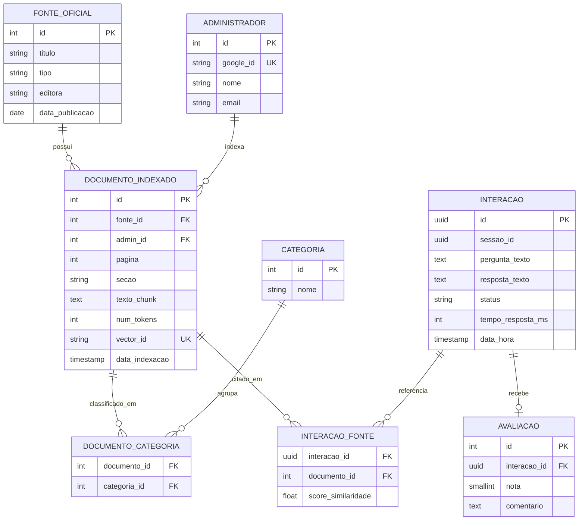
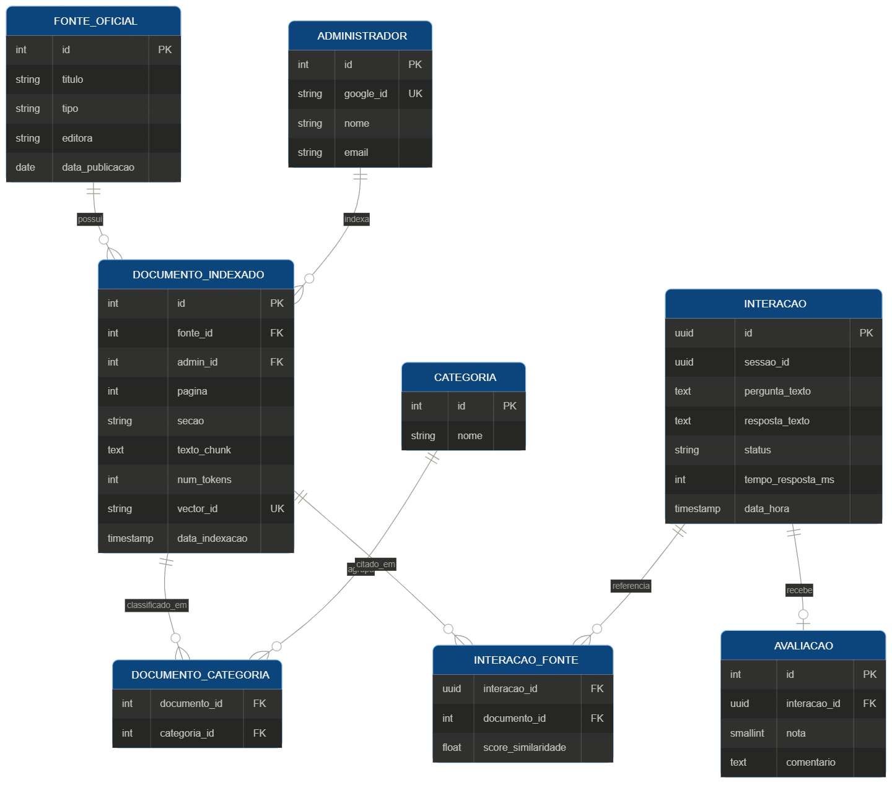

# RFC: Request for Comments — Projeto de Portfólio

**Engenharia de Software – Católica SC**

---

# Identificação


- **Título do Projeto:**  
  Respostas de Nimb.

  


- **Linha de Projeto (Direction):**  
  RAG usando IA e Processamento de Linguagem Natural para fornecer respostas rápidas e precisas sobre regras, cenários e mecânicas do jogo de RPG Tormenta20.

- **Autor:**  
  Rafael dos Santos Pereira

- **Data da Proposta:**  
  19/02/2026

- **Versão:**  
  1.0

---

# 1. Visão do Produto e Impacto (O Problema)

O objetivo desta seção é responder uma pergunta fundamental:

**Este projeto resolve um problema real ou é apenas um exercício técnico?**

---

Esse projeto em primeiro momento é um exercício técnico, mas tem potencial para atender um problema real, considerando a necessidade de respostas e discussões que acontecem dentro do universo de RPG (Tormenta20).
Com essa situação em mente, o projeto tem potencial para ser utilizado por jogadores e mestres, que buscam respostas rápidas e precisas para suas dúvidas sobre regras, cenários e mecânicas do jogo.

## 1.1 Contexto e Problema

Descreva claramente o problema que motivou o projeto.

Explique:

- Quem sofre com esse problema
  -- Jogadores e Mestres que jogam Tormenta20
- Em que contexto ele ocorre
  -- Durante sessões de RPG, onde por conta da narrativa e contexto, surgem dúvidas sobre regras, cenários e mecânicas do jogo.
- Como esse problema é resolvido atualmente
  -- Entre os jogadores presencialmente e em alguns casos atravessa para o cenário online através de fóruns, grupos de discussão e debates em comunidades online, onde os jogadores buscam respostas para suas dúvidas.
- Quais são as limitações das soluções atuais
  -- O processo hoje se dá de forma manual, onde os jogadores conversam e discutem as regras entre si, trazendo um viés de cada um dos envolvidos, o que pode levar a interpretações divergentes e discussões prolongadas

Sempre que possível apresente:

- exemplos reais
- prints de processos atuais
- descrições de fluxos existentes

---

## 1.2 Origem da Demanda e Evidências

É necessário demonstrar que existe **interesse real pela solução**.

Apresente pelo menos **uma evidência concreta**.

### Demanda Externa

Projeto solicitado por:

- grupo de usuários de RPG do Aluno

Inclua:

- Campeões de Svallas (grupo de RPG do aluno)
- Dúvidas e discussões sobre as regras do jogo

---

### Pesquisa com Usuários

- entrevistas
  >[Reddit](https://www.reddit.com/r/Tormenta/comments/1skhv02/projeto_de_tcc_respostas_de_nimb/)

- questionários
  >[Formulário](https://forms.cloud.microsoft/r/DxYnjK8A9F)


- observação de processos
>### Resultados Encontrados
>Número de pessoas entrevistadas
>26 respostas Obtidas até a data de 23/05/26
>- principais dores identificadas
>

>- padrões observados
>As respostas em sua maioria foram de aprovação ao projeto/ideia, onde foi demonstrado com as respostas coletadas que parte dos usuários utilizaria e mesmo pagaria para utilizar/usufruir de um sistema de IA para tirar dúvidas.
>

>

---

### Evidência de Interesse

Podem ser incluídos:

- cartas de intenção
- feedback de usuários
- comentários de comunidades
- resultados de formulários


---

## 1.3 Análise de Soluções Existentes (Benchmark)

Investigue **3 a 5 soluções existentes** que tentam resolver o mesmo problema.

Para cada solução apresente:

- nome do produto
- link
- público-alvo
- funcionalidades principais
- limitações

Inclua **prints da interface ou diagramas simplificados**.

---

### Comparação

| Solução | Pontos Fortes | Limitações |
| ------- | ------------- | ---------- |

---

### Diferencial do Projeto

Explique claramente:

- A ideia de fóruns e debates em comunidade para as regras já existentes é uma pratica comum dentro do contexto do RPG. A ideia é trazer uma ferramenta que ao ser alimentda e trabalhada consiga trazer um entendimento mais objetivo e direto da regra.
- As lacunas existentes hoje estão a nível comparativo a discussões juridicas na interpretação de leis, o que acaba ocorrendo é o vies de cada um dos envolvidos no debate, a ideia da IA é remover justamente o vies existente.
- O nicho atendido em primeira instancia é o do grupo de RPG que o aluno participa

---

## 1.4 Público-Alvo

Defina quem usará o sistema.

Exemplos:

- jogadores novatos
- jogadores veteranos
- mestres de RPG

Descreva:

### Jogadores e Mestres de Tormenta20

- Perfil do usuário: Jogadores e mestres de RPG que utilizam o sistema de regras de Tormenta20.
- Contexto de uso: Durante sessões de RPG, onde surgem dúvidas sobre regras, cenários e mecânicas do jogo.
- Nível de conhecimento técnico esperado: Qualquer nível de conhecimento no tema, e sem alto nível para uso o sistema, o objetivo é justamente trazer uma solução acessível para todos os níveis de jogadores e mestres.

---

## 1.5 Objetivos do Projeto

### Objetivo Geral

Qual transformação o projeto pretende gerar.

O projeto tem como objetivo criar um sistema de perguntas e respostas para o universo de Tormenta20 (RPG), utilizando técnicas de IA e Processamento de Linguagem Natural para fornecer respostas rápidas e precisas sobre regras, cenários e mecânicas do jogo, atendendo às necessidades de jogadores e mestres.

---

### Objetivos Específicos

Liste **3 a 5 objetivos técnicos ou de produto**.

Exemplo:

- Agilizar busca por regras e informações do jogo
- Permitir gerar contexto de aplicação das regras
- Fornecer respostas precisas e contextualizadas
- Criar uma base de conhecimento estruturada sobre o universo de Tormenta20

---

## 1.6 Métricas de Sucesso (KPIs)

Como saberemos que o projeto foi bem sucedido?

- acurácia da IA superior a 85%
- Respostas geradas com menos de 1 segundo de latência
- Respostas com nível de satisfação do usuário superior a 4 em uma escala de 1 a 5

---

# 2. Engenharia de Requisitos

Esta seção define **o que o sistema fará**.

Evite descrições vagas.

---

## 2.1 Personas

Crie **1 a 3 personas principais**.

Inclua:

- Nome fictício
- Contexto
- Objetivos
- Principais dificuldades

Adicionar **imagens ou ilustrações** pode ajudar na compreensão.

### Persona - Mestre
>- Nome: Cleber "Alface"
>- Contexto: Cleber é um mestre de Tormenta 20, com anos de experiencia, conhecimento dos livros e das regras. Sabe como balancear conflitos e conhece das regras com grande maestria
>- Objetivos: Tem como objetivo base pesquisar 
>- Principais dificuldades: Lembrar de valores especificos de magias/itens, caracteristicas de condições e caracteristicas de habilidades pontuais.


### Persona - Jogador Veterano
>- Nome: Vanderlei
>- Contexto: Vanderlei é um jogador veterano de Tormenta 20, com anos de experiencia, conhece as regras e tem uma boa compreensão do jogo. Ele gosta de explorar as mecânicas e criar estratégias complexas durante as sessões.
>- Objetivos: Vanderlei tem como objetivo base pesquisar regras e mecânicas específicas para otimizar suas jogadas e criar estratégias mais eficazes durante as sessões de RPG.
>- Principais dificuldades: Lembrar de detalhes específicos de regras, como interações entre habilidades, efeitos de magias e condições, o que pode impactar suas decisões durante o jogo.

### Persona - Jogador Novato
>- Nome: Robson
>- Contexto: Robson é um jogador novato de Tormenta 20, com pouco conhecimento das regras e mecânicas do jogo. Ele está começando a aprender sobre o universo de RPG e tem dificuldades para entender as regras complexas.
>- Objetivos: Robson tem como objetivo base aprender as regras e mecânicas do jogo de forma rápida e fácil, para poder participar das sessões de RPG sem se sentir perdido ou confuso.
>- Principais dificuldades: Entender as regras complexas, lembrar de detalhes específicos e encontrar informações relevantes durante as sessões de RPG, o que pode levar a frustração e desmotivação para jogar.
---

## 2.2 Casos de Uso Principais

Liste os principais fluxos do sistema.

Exemplo:

- Gerar respostas para perguntas sobre regras


Sempre que possível inclua **diagramas de caso de uso**.

---

## 2.3 Requisitos Funcionais (RF)

Use a estrutura:

> O sistema deve permitir que **[ator] realize [ação]**.


**RF01** — O sistema deve permitir que o usuário acesse uma interface de perguntas e respostas.

**RF02** — O sistema deve permitir que o usuário envie perguntas sobre regras do jogo.

**RF03** — O sistema deve permitir que o usuário visualize respostas geradas.

**RF04** - O sistema deve permitir que o usuário acesse uma interface de perguntas e respostas sem necessidade de instalação local, via navegador web.

**RF05** — O sistema deve permitir que o usuário envie perguntas em linguagem natural sobre regras, mecânicas e cenários do Tormenta20. 

**RF06** — O sistema deve permitir que o usuário visualize a resposta gerada pela IA com indicação da(s) fonte(s) do livro de regras consultada(s).

**RF07** — O sistema deve permitir que o usuário visualize o histórico de perguntas realizadas durante a sessão atual.

**RF08** — O sistema deve exibir uma mensagem clara quando não houver informação suficiente na base de conhecimento para responder à pergunta.

---

## 2.4 Requisitos Não Funcionais (RNF)

Inclua requisitos relacionados a:

- Desempenho
- Latência
- Segurança
- Escalabilidade
- Usabilidade
- Acurácia 

Exemplo:

**RNF01** — O tempo de resposta do sistema para perguntas deve ser inferior a 3 segundos em condições normais de uso 

**RNF02** — O tempo total entre o envio da pergunta e a exibição da resposta, incluindo busca vetorial e geração do modelo, deve ser inferior a 5 segundos.   

**RNF03** — O sistema deve ter campos de fácil entendimento, e legibilidade de leitura nas respostas.

**RNF04** — O modelo deve atingir acurácia de respostas avaliadas como corretas em ao menos 85% dos casos em testes com questões validadas por especialistas em Tormenta20.

**RNF05** - A arquitetura deve suportar aumento de carga sem refatoração, permitindo escalonamento horizontal dos serviços de backend.

---

## 2.5 Regras de Negócio

Exemplos:

- apenas usuários autenticados podem acessar determinados recursos
- determinadas operações exigem validação adicional

**RN01** — Somente conteúdo oficial de Tormenta20 

O sistema deve responder exclusivamente com base em materiais oficiais de Tormenta20 (livros, suplementos e erratas publicados pela Jambô Editora). Conteúdos de fanmade, regras-casa ou outros sistemas de RPG não devem ser indexados na base de conhecimento. 

**RN02** — Obrigatoriedade de citação de fonte 

Toda resposta gerada deve referenciar ao menos um trecho da base de conhecimento indexada. Respostas sem respaldo documental identificável não devem ser exibidas ao usuário. 

**RN03** — Limite de tokens por pergunta 

Perguntas enviadas pelo usuário devem ter no mínimo 10 caracteres e no máximo 500 caracteres, evitando consultas excessivamente vagas ou abusivas ao modelo de linguagem. 

Exemplo de rejeição: a pergunta "oi" é rejeitada com a mensagem "Por favor, elabore sua dúvida sobre as regras de Tormenta20." 

**RN04** — Não substituição de consulta ao mestre 

O sistema deve exibir um aviso padrão indicando que as respostas são baseadas na interpretação dos textos oficiais e que o mestre da sessão tem autoridade final sobre a aplicação das regras na mesa. 
---

## 2.6 Fora do Escopo

Liste explicitamente **o que o sistema não fará**.

Isso ajuda a evitar crescimento descontrolado do projeto.

Os itens abaixo estão explicitamente excluídos do escopo deste projeto para garantir foco e evitar crescimento descontrolado (scope creep): 

- Suporte a outros sistemas de RPG (D&D 5e, Pathfinder, Vampiro: A Máscara, etc.). 

- Geração de fichas de personagem ou calculadora de atributos. 

- Funcionalidade de chat em tempo real entre jogadores. 

- Criação de aventuras ou encontros de forma automatizada. 

- Suporte a áudio ou imagem como entrada de pergunta. 

- Aplicativo mobile nativo (iOS/Android) — o sistema será acessível via navegador responsivo. 

- Integração com plataformas de VTT (Virtual Tabletop) como Foundry VTT ou Roll20. 

- Funcionalidade de rolagem de dados. 

---

# 3. Fluxos e Comportamento do Sistema

Esta seção demonstra **como o sistema funciona**.

Use diagramas sempre que possível.

---

## 3.1 Fluxo Principal do Usuário

Apresente o fluxo principal do sistema.

Utilize:

- fluxogramas
- diagramas de atividades
- diagramas de sequência

Inclua **imagens dos diagramas**.

- O fluxo abaixo descreve o caminho feliz (happy path) de um usuário realizando uma consulta ao sistema:

>1. Usuário acessa a interface web do sistema via navegador.
>2. Sistema exibe a tela principal com campo de entrada de texto e histórico vazio.
>3. Usuário digita uma pergunta em linguagem natural sobre as regras de Tormenta20.
>4. Sistema valida a pergunta (tamanho mínimo/máximo e caracteres permitidos).
>5. Sistema realiza busca vetorial na base de conhecimento (documentos indexados via RAG).
>6. Sistema envia os trechos recuperados + pergunta original ao modelo de linguagem (LLM).
>7. LLM gera resposta contextualizada com base nos trechos recuperados.
>8. Sistema exibe a resposta ao usuário, com referência à(s) fonte(s) e trecho(s) consultado(s).
>9. Usuário avalia a resposta com nota de 1 a 5 estrelas (opcional).
>10. Sistema registra pergunta, resposta, fonte e avaliação nos logs estruturados.


---

## 3.2 Fluxos Alternativos

Descreva cenários como:

- erros
- cancelamentos
- exceções


- FA01 — Pergunta inválida (muito curta ou muito longa) 

>1. Usuário digita menos de 10 ou mais de 500 caracteres. 
>2. Sistema valida entrada e exibe mensagem: "Sua pergunta deve ter entre 10 e 500 caracteres." 
>3. Usuário corrige e reenvia a pergunta. 


- FA02 — Nenhum trecho relevante encontrado na base 

>1. Pipeline RAG não encontra trechos com similaridade acima do limiar mínimo definido. 
>2. Sistema exibe: "Não encontrei informações sobre este tema nos materiais oficiais de Tormenta20." 
>3. Sistema sugere categorias relacionadas para nova consulta. 


- FA03 — Timeout ou falha no modelo de linguagem 

>1. A chamada ao LLM excede o tempo limite de 10 segundos ou retorna erro. 
>2. Sistema exibe: "Ocorreu um problema ao gerar a resposta. Tente novamente em instantes." 
>3. Evento de erro é registrado nos logs com status e timestamp para análise. 
---

# 4. Mockups e Experiência do Usuário (UX)

Esta seção apresenta **a visualização inicial do produto antes da implementação**.

Mockups ajudam a validar:

- fluxo de navegação
- organização da interface
- interações do usuário
- clareza da experiência

Ferramentas sugeridas:

- Figma
- Excalidraw
- Balsamiq
- Whimsical
- protótipos desenhados à mão

---

## 4.1 Fluxo de Navegação

O sistema possui navegação linear e direta, com as seguintes telas principais: 

Login → Tela


Inclua **imagem do fluxo de navegação**.


---

## 4.2 Wireframes ou Mockups das Telas

Apresente os principais mockups do sistema.

Inclua pelo menos:

- tela inicial
- fluxo principal
- tela de entrada de dados
- tela de resultado ou visualização

Para cada tela inclua:

- imagem
- breve descrição da funcionalidade
- ações principais do usuário

Sempre que possível:

- inclua **links para protótipo navegável**

([Link Figma](https://www.figma.com/proto/mmPWrpSNUGNXV1SqOTu29b/Untitled?node-id=2-347&t=d1ss7nh4lTcwzYzZ-1&scaling=scale-down&content-scaling=fixed&page-id=0%3A1&starting-point-node-id=1%3A213))

- inclua **prints das telas**

Tela 1 — Login

Descrição: Apresenta o nome do sistema, pede entrada de login e senha por validação do Google

Ações principais do usuário: Fazer acesso ao sistema e validar credencial 


Tela 2 — Inicial / Home 

Descrição: Apresenta o nome do sistema, uma breve instrução de uso e o campo de entrada de pergunta centralizado na tela. 

Ações principais do usuário: Digitar a pergunta; selecionar categoria opcional; clicar em "Perguntar". 

Elemento de destaque: campo de texto amplo com placeholder "Qual é a sua dúvida sobre Tormenta20?". 


Tela 3 — Resultado da Pergunta 

Descrição: Exibe a pergunta original, a resposta gerada pelo sistema e o trecho de fonte consultada. 

Ações principais do usuário: Ler a resposta; visualizar a fonte citada; avaliar com 1 a 5 estrelas; refinar a pergunta. 

Elemento de destaque: card de resposta com destaque visual para o trecho do livro referenciado. 


---

## 4.3 Fluxo de Interação do Usuário

Demonstre passo a passo um fluxo importante.

Exemplo:

1. Usuário acessa o sistema pelo navegador durante a sessão de RPG. 
2. Visualiza o campo de pergunta e digita: "Magias de ilusão afetam criaturas cegas?" 
3. Clica em "Perguntar" e aguarda a resposta (~2-3 segundos). 
4. Lê a resposta com referência ao Livro Básico de Tormenta20, retornando a página/referência  

Inclua **sequência de telas ou fluxo visual**.

---

## 4.4 Feedback Inicial de Usuários (Opcional)

Se possível, inclua:

- comentários de usuários
- sugestões de melhoria
- validação inicial do mockup

---

# 5. Arquitetura do Sistema

Esta seção demonstra **como o sistema será construído**.

---

## 5.1 Diagrama C4

Apresente três níveis.

### 1. Nível 1: Diagrama de Contexto


É a **visão macro** do sistema. O foco aqui não é a tecnologia, mas sim como o software se encaixa no ecossistema e no mundo real.

- **Objetivo:** Mostrar o sistema como uma "caixa preta" e suas interações básicas com o ambiente externo.
- **O que incluir:**

| Elemento | Tipo | Descrição |
| :--- | :--- | :--- |
| Usuário (Jogador/Mestre) | Ator | Acessa o sistema via navegador para realizar perguntas sobre regras de Tormenta20. |
| Administrador | Ator | Gerencia a base de conhecimento (upload de documentos, monitoramento). |
| LLM Provider (ex.: Gemini / Ollama) | Sistema Externo | Provedor do modelo de linguagem que gera as respostas com base nos trechos recuperados. |
| Base Vetorial (ex.: Pinecone / ChromaDB) | Sistema Externo | Armazena os embeddings dos documentos de regras para busca semântica. |

---

### 2. Nível 2: Diagrama de Containers

Neste estágio, damos o primeiro **"zoom"**. Decompomos o sistema em suas unidades de execução independentes (containers).

- **Objetivo:** Apresentar a arquitetura de alto nível e as decisões tecnológicas fundamentais.
- **O que incluir:**

| Container | Tecnologia | Função | Protocolo |
| :--- | :--- | :--- | :--- |
| Frontend (SPA) | React + Vite | Interface do usuário — perguntas, respostas, histórico e avaliação. | HTTPS |
| API Gateway | FastAPI (Python) | Recebe requisições do frontend, orquestra o pipeline RAG e retorna respostas. | JSON/HTTPS |
| RAG Pipeline | LangChain + Python | Realiza busca vetorial, monta o contexto e chama o LLM. | Interno (função) |
| Vector Store | ChromaDB | Armazena embeddings dos documentos de regras para busca semântica. | gRPC / HTTP |
| Database (Logs) | PostgreSQL | Persiste perguntas, respostas, fontes e avaliações dos usuários. | SQL/TCP |

---


### 3. Nível 3: Diagrama de Componentes

O foco agora é o que acontece **dentro de um único container** (como uma API específica ou um serviço de backend).

- **Objetivo:** Identificar as responsabilidades internas, padrões de código e a organização lógica.
- **O que incluir:**
  - **Estrutura Interna:** Organização das camadas (Ex: Controladores, Serviços, Repositórios e Clientes de API).
  - **Lógica de Negócio:** Componentes que encapsulam as regras específicas do domínio.
  - **Interações:** Como os componentes internos se orquestram para processar e responder a uma requisição.

---

## 5.2 Modelo de Dados

Apresente:

- DER (diagrama entidade relacionamento)
- esquema relacional
- modelo de documentos (NoSQL)

### 5.2.1 Esquema Relacional (PostgreSQL)

| Tabela | Finalidade |
| :--- | :--- |
| `fonte_oficial` | Catálogo dos livros/suplementos/erratas oficiais de Tormenta20 que alimentam a base (RN01). |
| `documento_indexado` | Metadados de cada chunk de texto extraído de uma fonte e indexado no banco vetorial. |
| `categoria` | Taxonomia de assuntos (Magias, Combate, Classes, Condições, Itens etc.) usada para filtrar a busca. |
| `documento_categoria` | Associação N:N entre chunks e categorias. |
| `interacao` | Log estruturado de cada pergunta/resposta (passo 10 do fluxo principal, Seção 3.1). |
| `interacao_fonte` | Associação N:N entre uma interação e os chunks citados como fonte da resposta (RN02). |
| `avaliacao` | Nota de 1 a 5 estrelas dada pelo usuário a uma resposta (RF, Tela 3). |
| `administrador` | Conta dos curadores responsáveis por enviar/atualizar documentos na base de conhecimento. |

```sql
CREATE TABLE fonte_oficial (
    id              SERIAL PRIMARY KEY,
    titulo          VARCHAR(150) NOT NULL,
    tipo            VARCHAR(30)  NOT NULL,      -- livro | suplemento | errata
    editora         VARCHAR(80)  NOT NULL DEFAULT 'Jambô Editora',
    versao          VARCHAR(20),
    data_publicacao DATE
);

CREATE TABLE administrador (
    id           SERIAL PRIMARY KEY,
    google_id    VARCHAR(120) UNIQUE NOT NULL,
    nome         VARCHAR(120) NOT NULL,
    email        VARCHAR(150) NOT NULL,
    data_cadastro TIMESTAMP NOT NULL DEFAULT now()
);

CREATE TABLE documento_indexado (
    id              SERIAL PRIMARY KEY,
    fonte_id        INTEGER NOT NULL REFERENCES fonte_oficial(id),
    admin_id        INTEGER REFERENCES administrador(id),
    pagina          INTEGER,
    secao           VARCHAR(150),
    texto_chunk     TEXT NOT NULL,
    num_tokens      INTEGER NOT NULL,
    hash_conteudo   VARCHAR(64) NOT NULL,        -- detecta duplicidade/atualização
    vector_id       VARCHAR(64) UNIQUE NOT NULL, -- chave do registro correspondente no ChromaDB
    data_indexacao  TIMESTAMP NOT NULL DEFAULT now()
);

CREATE TABLE categoria (
    id        SERIAL PRIMARY KEY,
    nome      VARCHAR(60) NOT NULL UNIQUE,
    descricao TEXT
);

CREATE TABLE documento_categoria (
    documento_id INTEGER REFERENCES documento_indexado(id),
    categoria_id INTEGER REFERENCES categoria(id),
    PRIMARY KEY (documento_id, categoria_id)
);

CREATE TABLE interacao (
    id               UUID PRIMARY KEY DEFAULT gen_random_uuid(),
    sessao_id        UUID NOT NULL,               -- identificador efêmero, sem vínculo com conta
    pergunta_texto   TEXT NOT NULL,
    resposta_texto   TEXT,
    status           VARCHAR(20) NOT NULL,         -- sucesso | sem_resultado | erro_timeout
    tempo_resposta_ms INTEGER,
    data_hora        TIMESTAMP NOT NULL DEFAULT now()
);

CREATE TABLE interacao_fonte (
    interacao_id      UUID REFERENCES interacao(id),
    documento_id      INTEGER REFERENCES documento_indexado(id),
    score_similaridade REAL NOT NULL,
    PRIMARY KEY (interacao_id, documento_id)
);

CREATE TABLE avaliacao (
    id            SERIAL PRIMARY KEY,
    interacao_id  UUID UNIQUE REFERENCES interacao(id),
    nota          SMALLINT NOT NULL CHECK (nota BETWEEN 1 AND 5),
    comentario    TEXT,
    data_hora     TIMESTAMP NOT NULL DEFAULT now()
);
```


### 5.2.2 Diagrama Entidade-Relacionamento (DER)





### 5.2.3 Modelo de Documentos (NoSQL — Banco Vetorial)

O ChromaDB armazena uma **coleção** (`tormenta20_regras`) com um documento por chunk indexado. Cada registro guarda o embedding usado na busca por similaridade e um bloco de metadados que espelha a linha correspondente em `documento_indexado`, permitindo filtrar a busca vetorial por fonte, categoria ou página antes (ou depois) do cálculo de similaridade.

```json
{
  "id": "doc_00231",
  "embedding": [0.0123, -0.0451, 0.0872, "... (768 ou 1536 dimensões, conforme o modelo de embedding escolhido)"],
  "document": "Criaturas cegas têm 50% de chance de errar ataques corpo a corpo contra alvos que não estejam adjacentes...",
  "metadata": {
    "documento_id": 231,
    "fonte_titulo": "Tormenta20 - Livro Básico",
    "pagina": 145,
    "secao": "Magias - Escola de Ilusão",
    "categorias": ["Magias", "Condições"],
    "num_tokens": 180,
    "data_indexacao": "2026-03-10"
  }
}
```

- `id` é o mesmo valor salvo em `documento_indexado.vector_id`, garantindo rastreabilidade entre a base relacional e a base vetorial.
- `embedding` é gerado uma única vez na indexação (Etapa "Fragmentar livros e construir regras de chunks" do cronograma, Seção 7) e recalculado apenas se `hash_conteudo` mudar.
- `metadata` é usado pelo pipeline RAG (LangChain) para aplicar filtros antes da busca por similaridade (ex.: restringir a categoria "Magias") e para montar a citação de fonte exigida por RN02.
- O texto completo do chunk é mantido tanto no ChromaDB (`document`) quanto em `documento_indexado.texto_chunk`; isso evita uma chamada extra ao vector store apenas para exibir o trecho-fonte na Tela 3 (Resultado da Pergunta).

---


## 5.3 Principais Componentes

Descreva os principais módulos do sistema.

Exemplo:


- RAG Pipeline (LangChain): Responsável por gerar embeddings, buscar trechos relevantes na base vetorial, montar o prompt e chamar o LLM. 
- LLM Provider (API externa): Modelo de linguagem (ex.: Gemini ou Ollama) responsável por gerar a resposta final com base no contexto recuperado.

>Passíveis de mudança (tecnologia) ou posterior validação durante processo de desenvolvimento
>>Frontend (React + Vite): Interface responsiva para perguntas, respostas, histórico e avaliações. Comunica-se com o backend via REST API. 
>>API Gateway (FastAPI): Ponto de entrada do backend. Valida requisições, orquestra o pipeline RAG e retorna respostas formatadas.
>>Banco de Dados Relacional (PostgreSQL): Persiste perguntas, respostas, fontes, avaliações e logs de uso para análise de métricas. 

---

## 5.4 Stack Tecnológica

Liste as tecnologias utilizadas.

Para cada tecnologia explique **por que ela foi escolhida**.

| Tecnologia | Camada | Justificativa |
| :--- | :--- | :--- |
| **Python 3.11+** | Backend / Pipeline | Amplo ecossistema de IA/ML, suporte nativo a LangChain, FastAPI e bibliotecas de NLP. |
| **FastAPI** | API Gateway | Alta performance assíncrona, geração automática de documentação OpenAPI e tipagem forte com Pydantic. |
| **LangChain** | RAG Pipeline | Framework consolidado para construção de pipelines RAG, abstração de múltiplos provedores de LLM e vector stores. |
| **ChromaDB** | Vector Store | Base vetorial leve, open-source e embarcável. Ideal para o volume inicial do projeto sem necessidade de infraestrutura externa. |
| **Gemini/Ollama** | LLM Provider | Modelos de linguagem de alta qualidade com suporte a prompts longos e contexto estruturado, adequados para respostas precisas sobre regras. |
| **PostgreSQL** | Banco de Dados | Banco relacional robusto, open-source e bem documentado. Adequado para persistência de logs e avaliações com suporte a consultas analíticas. |
| **React + Vite** | Frontend | Biblioteca moderna para SPAs, com ecossistema maduro e build rápido via Vite. Facilita criação de interfaces responsivas. |
| **Stitch** | Frontend | Ferramenta para Prototipação de tela|
| **Figma** | Frontend | Construção de base de telas e como as informações serão apresentadas e definidas|

>Ferramenta para Prototipação de tela
>>Stitch

>Construção de base de telas e como as informações serão apresentadas e definidas
>>Figma

---


># Sugestões e Tecnologias a serem validadas e consideradas
>Amazon AWS - S3 
>>Buscar informações de banco de dados imagens e coisas do tipo

>Open Router 
>>Gerenciamento de API Keys para uso das IAs, ferramenta para buscar das IAs gratuitas reduzir consumo

>Amazon AWS - Iam 
>>

>Stitch
>>Ferramenta para Prototipação de tela

>Figma
>>Construção de base de telas e como as informações serão apresentadas e definidas

# 6. Segurança e Privacidade

Inclua preocupações básicas de segurança.

Exemplos:

- proteção contra OWASP Top 10
- autenticação e autorização
- criptografia de dados sensíveis

- Sem acesso a banco direto, apenas por uso do sistema.
- Validação e checagem de login via Google

---

## 6.1 Privacidade e LGPD

Explique:

- quais dados serão coletados
 - Quanto a dados coletados, não será feita coleta de dados. De modo que não terá uma persistencia de perguntas entre as sessões.

- como serão armazenados
 - Os dados base referente a base de dados será disponpivel via cloud(a ser definida), assim o usuário final terá acesso apenas aos dados já tratados e com o resultado sendo apresentado em tela após o consumo da informação.
 
- como o usuário poderá solicitar remoção de dados


- __Sistema de login terceirizado, onde será usada API do Google__
- __Não é consumido ou salvo dados dos usuários ao gerar e consultar o sistema__
- __Os dados(RAG) serão armazenados online, sem acesso direto do usuário final__


---

# 7. Planejamento do Projeto

Defina os principais marcos de desenvolvimento.

| Marco | Descrição                             | Prazo    |
| ----- | ------------------------------------- | -------- |
| []    | Fragmentar livros e construir regras de chunks | Semana - |
| []    | Estruturar Meta dados para pesquisa e validação| Semana - |
| []    | Estruturar banco de dados  | Semana - |
| []    | Gerar estrutura e banco (vetorial)    | Semana - |
| []    | Desenvolver lógica para recuperar chunks | Semana |
| []    | Gerar regras de segurança (Alucinação) | Semana - |
| []    | Fragmentar primeira estrutura de Front | Semana - |

---

# 8. Referências

Inclua:

- artigos
- documentação técnica
- ferramentas utilizadas
- repositórios

- ferramentas de IA
>Validação encaminhada pelo Professor Diogo
>[Validação RFC](https://chatgpt.com/g/g-6a277857474081919777d857496ce513-avaliador-de-app-gdd-portfolio-catolica-sc)

---

# 9. Apêndices

Podem incluir:

- entrevistas com usuários
- diagramas complementares
- links para protótipos ou repositórios
- mockups adicionais


Sempre que possível inclua **imagens, protótipos ou referências visuais**.

---

# 10. Parecer do Comitê de Avaliação

(A ser preenchido pelos professores)

**Avaliador 1:** \***\*\*\*\*\*\*\***\_\_\***\*\*\*\*\*\*\***  
**Status:** [ ] Aprovado [ ] Ajustar

Observações:

---

**Avaliador 2:** \***\*\*\*\*\*\*\***\_\_\***\*\*\*\*\*\*\***  
**Status:** [ ] Aprovado [ ] Ajustar

Observações:

---

**Avaliador 3:** \***\*\*\*\*\*\*\***\_\_\***\*\*\*\*\*\*\***  
**Status:** [ ] Aprovado [ ] Ajustar

Observações:
