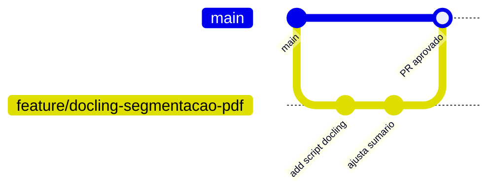
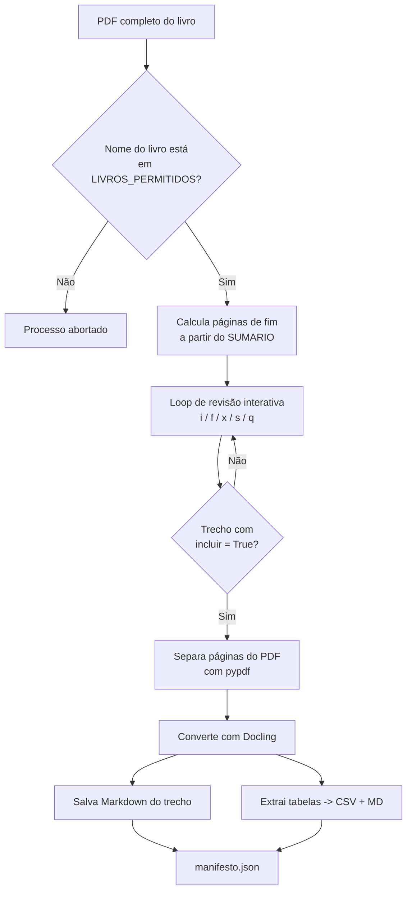

# Tutorial — Repositório Git + Segmentação/Conversão de PDF com Docling

Projeto de referência: **PAC-Resposta-de-Nimb**
🔗 https://github.com/radsrei/PAC-Resposta-de-Nimb

> Esse repositório já usa **Docling** como um dos "loaders" da etapa de
> *Indexing* do pipeline RAG (ver `README.md` do repo, seção *Indexing*).
> Os arquivos gerados aqui (`docling_pdf_splitter.py`, Markdown por capítulo,
> tabelas em CSV) foram pensados para alimentar exatamente essa etapa.

---

## Parte 1 — Fluxo de trabalho no Git (passo a passo)

### 1.1 Clonar o repositório pela primeira vez

```bash
git clone https://github.com/radsrei/PAC-Resposta-de-Nimb.git
cd PAC-Resposta-de-Nimb
```

### 1.2 Configurar seu usuário (se ainda não tiver feito na máquina)

```bash
git config --global user.name "Seu Nome"
git config --global user.email "seu-email@exemplo.com"
```

### 1.3 Criar o ambiente virtual (o próprio README do repo já pede isso)

```bash
python3.11 -m venv env
source env/bin/activate        # Linux/macOS
# env\Scripts\activate         # Windows PowerShell

pip install -U pip
pip install -r requirements.txt
pip install docling pypdf pandas   # dependências específicas deste script
```

### 1.4 Criar uma branch dedicada para esta funcionalidade

Nunca commitar direto na `main`. Crie uma branch com nome descritivo:

```bash
git checkout main
git pull origin main
git checkout -b feature/docling-segmentacao-pdf
```

### 1.5 Adicionar os arquivos novos ao repositório

Sugestão de organização (seguindo o padrão de pastas que o repo já usa,
como `estrutura-Exemplo/`):

```
PAC-Resposta-de-Nimb/
└── indexing/
    └── docling-loader/
        ├── docling_pdf_splitter.py
        ├── requirements.txt
        └── saida/                <- pasta de saída (git-ignorada)
```

```bash
mkdir -p indexing/docling-loader
cp docling_pdf_splitter.py indexing/docling-loader/
cp requirements.txt indexing/docling-loader/requirements-docling.txt
```

Adicione a pasta de saída ao `.gitignore` (o repo já tem um arquivo
`.gitignore` — só adicionar a linha):

```bash
echo "indexing/docling-loader/saida/" >> .gitignore
echo "*.pdf" >> .gitignore   # opcional: não versionar os PDFs completos do livro (arquivos grandes)
```

### 1.6 Commit e push

```bash
git add indexing/docling-loader/docling_pdf_splitter.py
git add indexing/docling-loader/requirements-docling.txt
git add .gitignore

git status                     # conferir o que vai entrar no commit
git commit -m "feat(indexing): adiciona segmentador/conversor de PDF via Docling"

git push -u origin feature/docling-segmentacao-pdf
```

### 1.7 Abrir o Pull Request

```bash
gh pr create --base main --head feature/docling-segmentacao-pdf \
  --title "feat: segmentador de PDF com Docling" \
  --body "Adiciona script que separa o livro por capítulo/seção (baseado no sumário) e converte cada trecho com Docling, extraindo tabelas em CSV."
```

> Não tem o `gh` (GitHub CLI) instalado? Basta acessar o link que o `git push`
> imprime no terminal (algo como
> `https://github.com/radsrei/PAC-Resposta-de-Nimb/pull/new/feature/docling-segmentacao-pdf`)
> e abrir o PR direto pelo navegador.

### 1.8 Comandos do dia a dia (referência rápida)

| Ação | Comando |
|---|---|
| Ver status | `git status` |
| Ver diferenças antes de commitar | `git diff` |
| Trazer atualizações da `main` para sua branch | `git fetch origin && git merge origin/main` |
| Ver histórico | `git log --oneline --graph --all` |
| Desfazer alterações não commitadas de um arquivo | `git checkout -- caminho/arquivo.py` |
| Trocar de branch | `git checkout nome-da-branch` |

### 1.9 Ilustração do fluxo (Git Flow simplificado)



📺 Vídeos de apoio (oficiais/bem avaliados) sobre o fluxo Git usado acima:
- "Git and GitHub for Beginners" — freeCodeCamp: https://www.youtube.com/watch?v=RGOj5yH7evk
- Documentação oficial de Pull Requests do GitHub: https://docs.github.com/pull-requests

---

## Parte 2 — Conversão/segmentação do PDF com Docling

### 2.1 O que é o Docling

O Docling é uma biblioteca open-source (mantida pela LF AI & Data, criada
pela IBM Research) que converte PDF, DOCX, PPTX, HTML, imagens etc. em uma
representação estruturada única (`DoclingDocument`), da qual dá para
exportar Markdown, JSON, texto e **tabelas** já reconhecidas como tal (e não
como "sopa de texto").

Documentação oficial: https://docling-project.github.io/docling/getting_started/quickstart/

Exemplo mínimo (é a base do que o script faz por trás):

```python
from docling.document_converter import DocumentConverter

conversor = DocumentConverter()
resultado = conversor.convert("meu_arquivo.pdf")
documento = resultado.document

print(documento.export_to_markdown())
```

### 2.2 Instalação

```bash
pip install docling pypdf pandas
```

> Na primeira execução, o Docling baixa os modelos de layout/tabela — pode
> demorar alguns minutos e precisa de internet nessa primeira vez.

### 2.3 Estrutura do script `docling_pdf_splitter.py`

O script (entregue junto com este tutorial) tem 6 blocos:

1. **Configuração geral** (`CONFIG`) — caminho do PDF, pasta de saída, nome
   do livro.
2. **Condição pelo nome do livro** (`LIVROS_PERMITIDOS` /
   `checar_condicao_livro`) — só processa se o nome do livro configurado
   estiver na lista permitida. Serve como trava de segurança.
3. **Mapa do sumário** (`SUMARIO`) — lista de capítulos/seções com página
   inicial, já pré-preenchida com base na imagem do sumário que você
   enviou (Tormenta20 — Livro Básico). Cada item tem uma flag `incluir`.
4. **Loop de revisão interativa** (`revisar_sumario_interativo`) — antes de
   processar, você pode editar início/fim de página e ligar/desligar cada
   trecho digitando comandos simples no terminal.
5. **Separação do PDF** (`separar_pdf`, via `pypdf`) — gera um PDF menor
   só com as páginas daquele trecho.
6. **Conversão com Docling + extração de tabelas** (`converter_com_docling`,
   `salvar_tabelas`) — gera Markdown e CSVs de cada tabela encontrada.

### 2.4 Passo a passo de uso

**Passo 1 — Ajuste o caminho do PDF e o nome do livro**, no topo do
arquivo `docling_pdf_splitter.py`:

```python
CONFIG = {
    "pdf_entrada": "/mnt/user-data/uploads/tormenta20_livro_basico.pdf",
    "pasta_saida": "/mnt/user-data/outputs/tormenta20_segmentado",
    "nome_livro": "Tormenta20 - Livro Básico",
    "total_paginas_pdf": 404,
}
```

**Passo 2 — Confira/edite `LIVROS_PERMITIDOS`** — se o nome do seu livro
não estiver nessa lista, o script recusa a rodar (é a "condição para o nome
do livro" pedida):

```python
LIVROS_PERMITIDOS = [
    "Tormenta20 - Livro Básico",
    "Tormenta20 - Ameacas de Arton",
]
```

**Passo 3 — Confira a lista `SUMARIO`** — já vem com os capítulos do livro
enviado. Ajuste páginas caso a versão do seu PDF tenha uma paginação
diferente da impressa.

**Passo 4 — Rode o script:**

```bash
python3 docling_pdf_splitter.py
```

Isso abre o **modo revisão interativa** no terminal, trecho por trecho:

```
● [INCLUI] Introdução — páginas 6–13
   >
```

Comandos disponíveis nesse ponto:

| Comando | Efeito |
|---|---|
| `Enter` | aceita o trecho como está e vai para o próximo |
| `i 8` | muda a página de **início** para 8 |
| `f 12` | muda a página de **fim** para 12 |
| `x` | liga/desliga esse trecho (inclui ou exclui da conversão) |
| `s` | pula a revisão do restante (aceita tudo como está) |
| `q` | aborta o processo |

> É exatamente aqui que você "corta" agradecimentos, ficha técnica,
> prefácio protocolar etc.: ou desliga o trecho inteiro com `x`, ou ajusta
> `i`/`f` para pular só aquelas páginas.

**Passo 5 (opcional) — pular a revisão** e processar direto com o que já
está configurado no código:

```bash
python3 docling_pdf_splitter.py --auto
```

### 2.5 O que é gerado na saída

```
tormenta20_segmentado/
├── manifesto.json                     <- índice de tudo que foi gerado
├── introducao/
│   ├── introducao.pdf                 <- páginas 6–13 separadas
│   ├── introducao.md                  <- conteúdo convertido pelo Docling
│   └── tabelas/                       <- (se houver tabelas no trecho)
├── capitulo_1_construcao_de_personagem/
│   ├── capitulo_1_construcao_de_personagem.pdf
│   ├── capitulo_1_construcao_de_personagem.md
│   └── tabelas/
│       ├── capitulo_1..._tabela_01.csv
│       └── capitulo_1..._tabela_01.md
...
```

O `manifesto.json` guarda, para cada trecho processado: título, páginas,
caminho do PDF parcial, caminho do Markdown e quantidade de tabelas — útil
para o passo seguinte do pipeline RAG (indexação/chunking).

### 2.6 Ilustração do fluxo do script



📺 Vídeos/artigos de apoio sobre Docling:
- Quickstart oficial (com exemplos de código): https://docling-project.github.io/docling/getting_started/quickstart/
- Tutorial completo (DataCamp) construindo um app de RAG com Docling: https://www.datacamp.com/tutorial/docling
- Repositório oficial com exemplos prontos: https://github.com/docling-project/docling

---

## Parte 3 — Checklist final antes do commit

- [ ] Rodei o script em modo interativo pelo menos uma vez e conferi as
      páginas de cada capítulo contra o PDF real.
- [ ] Marquei `incluir = False` nos trechos protocolares que não interessam
      (prefácio, playtesters, índice remissivo, etc.).
- [ ] Testei `LIVROS_PERMITIDOS` com um nome de livro fora da lista, para
      confirmar que o script realmente bloqueia.
- [ ] Conferi ao menos um `.md` gerado e uma tabela `.csv` extraída.
- [ ] Adicionei a pasta de saída e os PDFs grandes ao `.gitignore`.
- [ ] Criei a branch, commitei com mensagem descritiva e abri o PR.
